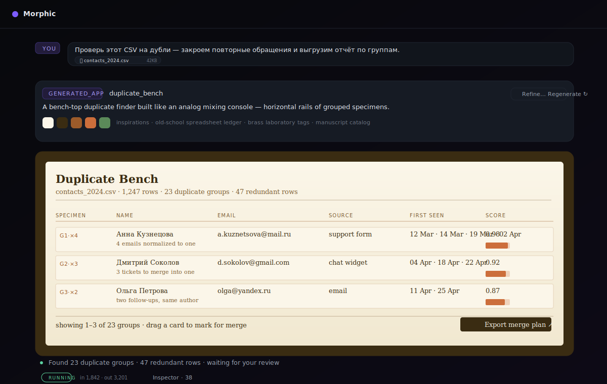

<div align="center">


<p>
  <a href="#quickstart"></a>
  
  
  
  
</p>

</div>

> **Morphic** is a generative human-experience runtime for AI agents.
> User describes a task. Morphic **directs** a unique visual concept for it,
> generates a self-contained mini-app on the fly, and runs it inside a
> sandboxed iframe that talks back through a safe bridge.

Not a chat. Not a dashboard builder. Not a component library. Each task
gets its own interface, designed to fit the task — not a templated one.

```text
Intent → Plan + Visual Brief → Generated mini-app → Bridged tools
```

---

## Why "non-template"

A normal LLM-generated UI converges on the same generic look:
three-column dark cards, sidebar, hamburger, glassmorphism. Every task
ends up feeling the same. Morphic fights this in two places:

1. **The Director** outputs a structured *visual brief* — a concrete
   metaphor (a duplicate-finder bench, a sonar sweep, a reading room),
   palette, typography, motion, and an **explicit list of banned
   defaults**.
2. **The UI Generator** prompt treats the brief as a constraint and
   forbids the common SaaS defaults.

Result: a CSV cleaner doesn't look like an influencer scout, which
doesn't look like a deploy console.

<div align="center">
  <table>
    <tr>
      <td align="center" width="50%">
        
        <sub><b>generated_app · duplicate_bench</b><br/>warm paper palette, ledger typography, horizontal rails of grouped specimens</sub>
      </td>
      <td align="center" width="50%">
        
        <sub><b>status_view · influencer_scouting_radar</b><br/>cold sonar palette, monospaced HUD, concentric range rings</sub>
      </td>
    </tr>
  </table>
</div>

Same runtime, two completely different generated interfaces — picked
and built per task.

---

## Architecture

<div align="center">
  
</div>

| Module                              | Role                                                                                                   |
|-------------------------------------|--------------------------------------------------------------------------------------------------------|
| `apps/api/src/director.py`          | One LLM pass → presentation plan + visual brief (palette, typography, layout, motion, banned defaults) |
| `apps/api/src/codegen.py`           | UI Generator. Consumes the brief, emits one self-contained HTML doc.                                   |
| `apps/api/src/runtime_stub.py`      | `window.agui.*` shim injected into every served document.                                              |
| `apps/api/src/executor.py`          | Tool Broker + Permission Layer + dry-run + approvals.                                                  |
| `apps/api/src/tools.py`             | Built-in capabilities (LLM, data.*, web.search, files.read, task.*, optional cli.*).                   |
| `apps/api/src/mcp_client.py`        | Stdio MCP-client manager. Auto-registers each MCP tool as `mcp.<alias>.<name>`.                        |
| `apps/api/src/openapi_adapter.py`   | Loads any OpenAPI 3.x spec, exposes every operation as `openapi.<alias>.<op>`.                         |
| `apps/api/src/narrator.py`          | Turns raw events into single-sentence human commentary (`narration` events).                           |
| `apps/api/src/tasks.py`             | Domain model: Thread → Turn → events / state / files.                                                  |
| `apps/api/src/persistence.py`       | SQLite store with hydration on boot.                                                                   |
| `apps/api/src/audit.py`             | Append-only audit of tool calls and approvals.                                                         |
| `apps/web/src/App.tsx · Turn.tsx`   | Threaded workspace, composer with file attachments, plan-steering, regenerate.                         |
| `apps/web/src/bridge.ts`            | Per-turn iframe ↔ backend bridge.                                                                      |

---

## The interaction model

<div align="center">
  
</div>

- **Threaded workspace.** Each user message is a *turn*; Morphic's reply
  is `plan card → generated iframe → live narration → final result`.
  Old turns auto-collapse so the active one stays in focus.
- **Plan steering.** Before codegen burns tokens you see the planned
  presentation_mode + visual_concept + steps + tool list. Decide:
  Proceed · Cancel.
- **Refine + regenerate.** Don't like the visual? Click `Refine…`, type
  *"warmer palette, denser table, add export button"*, and Morphic
  regenerates the document keeping the metaphor.
- **File attachments.** Upload from the composer; available inside the
  iframe via `await agui.readFile(id)`.
- **Cancel anytime.** Hard cancel signals release pending approvals,
  stop the pipeline, and persist the cancelled state.
- **Inspector.** Per-turn raw event stream + token usage, hidden by
  default for non-developers.

---

## Bridge API (inside the generated UI)

```js
agui.plan, agui.tools, agui.goal, agui.taskId, agui.files

await agui.callTool(name, params)          // run a registered tool
await agui.askApproval(label, details)     // request a one-off human OK
await agui.readFile(file_id)               // read an attached file
agui.setState(patch)
agui.getState()
agui.finalResult(value)
agui.log(level, message)
agui.toast(message, kind)
agui.onEvent(handler)
```

Sandbox is `allow-scripts` only — **no** `allow-same-origin`, **no**
network, **no** parent DOM access. The bridge is the only escape hatch.

---

## Quickstart

```bash
git clone https://github.com/pavelbar137-lang/agui.git morphic
cd morphic
cp .env.example .env   # put your provider key in AGUI_LLM_API_KEY

# backend
cd apps/api
python -m venv .venv && . .venv/bin/activate
pip install -e .
uvicorn src.main:app --reload --port 8001

# frontend (separate terminal)
cd apps/web
npm install
npm run dev
```

Open <http://localhost:5173>. Vite proxies `/api` → `http://localhost:8001`.

Or with Docker:

```bash
docker compose up --build api web                  # dev (web :5173, api :8001)
docker build --target production -t morphic .      # prod single-image (nginx + uvicorn)
```

---

## Provider configuration

Morphic is provider-agnostic. Pick the protocol your provider speaks:

| Var                   | Default                              | Notes                                  |
|-----------------------|--------------------------------------|----------------------------------------|
| `AGUI_LLM_PROTOCOL`   | `anthropic`                          | `anthropic` (Messages) or `openai`     |
| `AGUI_LLM_BASE_URL`   | `https://api.minimax.io/anthropic`   | Provider base URL.                     |
| `AGUI_LLM_MODEL`      | `MiniMax-M2`                         | Model id.                              |
| `AGUI_LLM_API_KEY`    | —                                    | API key.                               |
| `AGUI_LLM_MAX_TOKENS` | `4096`                               |                                        |
| `AGUI_LLM_TEMPERATURE`| `0.6`                                |                                        |
| `TAVILY_API_KEY`      | —                                    | Real `web.search` if set.              |
| `AGUI_MCP_CONFIG`     | `.agui/mcp.json`                     | Optional MCP server config.            |
| `AGUI_DATA_DIR`       | `.agui-data`                         | SQLite + uploads live here.            |
| `AGUI_ENABLE_CLI`     | unset                                | Enables `cli.*` host-CLI tools.        |
| `AGUI_CLI_ALLOWLIST`  | unset                                | Optional `:`-separated allowlist.      |

> Default is **MiniMax M2** via its Anthropic-compatible endpoint. Switch to
> OpenAI / Groq / OpenRouter / Together by changing the four `AGUI_LLM_*`
> vars — no SDK changes required.

---

## Tool discovery

### MCP servers

Drop a `.agui/mcp.json` at repo root:

```json
{
  "servers": [
    { "alias": "fs",   "command": "npx", "args": ["-y", "@modelcontextprotocol/server-filesystem", "/tmp"] },
    { "alias": "git",  "command": "uvx", "args": ["mcp-server-git", "--repository", "."] }
  ]
}
```

On boot Morphic spawns each server, calls `tools/list`, and registers
every tool as `mcp.<alias>.<name>` — immediately callable from any
generated UI via `agui.callTool(...)`.

### OpenAPI

```bash
curl -X POST http://localhost:8001/api/tools/openapi -H 'content-type: application/json' -d '{
  "alias": "petstore",
  "spec_url": "https://petstore3.swagger.io/api/v3/openapi.json",
  "base_url": "https://petstore3.swagger.io/api/v3",
  "auth_header_name": "Authorization",
  "auth_header_value": "Bearer ..."
}'
```

Every operation becomes a callable tool: `openapi.petstore.findPetsByStatus`, etc.

### Host CLI tools

Set `AGUI_ENABLE_CLI=1` and optional `AGUI_CLI_ALLOWLIST=git:gh:jq`.
A curated set of common binaries (`git`, `gh`, `curl`, `jq`, `docker`,
`kubectl`, …) becomes available as `cli.<name>` tools, gated by approval.

---

## Endpoints

| Method | Path                                       | Purpose                                  |
|--------|--------------------------------------------|------------------------------------------|
| POST   | `/api/threads`                             | Create thread + first turn               |
| GET    | `/api/threads`                             | List threads                             |
| GET    | `/api/threads/{tid}`                       | Thread + ordered turns                   |
| POST   | `/api/threads/{tid}/turns`                 | Add a follow-up turn                     |
| GET    | `/api/turns/{tid}`                         | Snapshot                                 |
| GET    | `/api/turns/{tid}/ui`                      | Generated HTML (with runtime injected)   |
| GET    | `/api/turns/{tid}/events`                  | SSE event stream (replayable)            |
| POST   | `/api/turns/{tid}/tools/{name}`            | Run a tool (bridge target)               |
| POST   | `/api/turns/{tid}/approve`                 | Resolve a pending approval               |
| POST   | `/api/turns/{tid}/proceed`                 | Proceed past plan steering               |
| POST   | `/api/turns/{tid}/cancel`                  | Cancel a turn                            |
| POST   | `/api/turns/{tid}/regenerate`              | Re-run codegen, optional `refine_note`   |
| POST   | `/api/files`                               | Upload a file                            |
| GET    | `/api/files/{fid}`                         | Download                                 |
| GET    | `/api/tools`                               | Registered tools                         |
| POST   | `/api/tools/openapi`                       | Register an OpenAPI spec                 |
| GET    | `/api/audit?turn_id=&limit=`               | Audit tail                               |

---

## Roadmap

- [ ] HTTP/SSE transport for MCP (right now: stdio only)
- [ ] LLM router for "refine current turn vs. open a new turn" decision
- [ ] Streaming partial codegen (show the document being drawn)
- [ ] Cost dashboard + per-tool latency
- [ ] Saved presets per organization (palette / typography defaults)

---

<div align="center">
  <sub>
    Morphic · MIT · the interface takes the shape of the task
  </sub>
</div>
