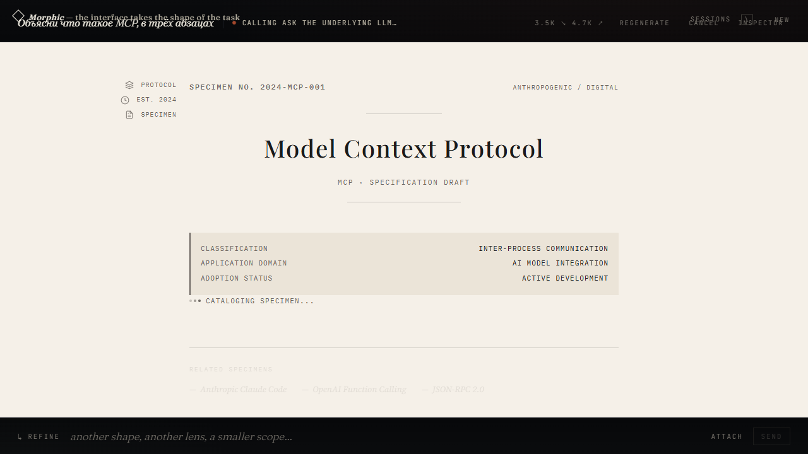
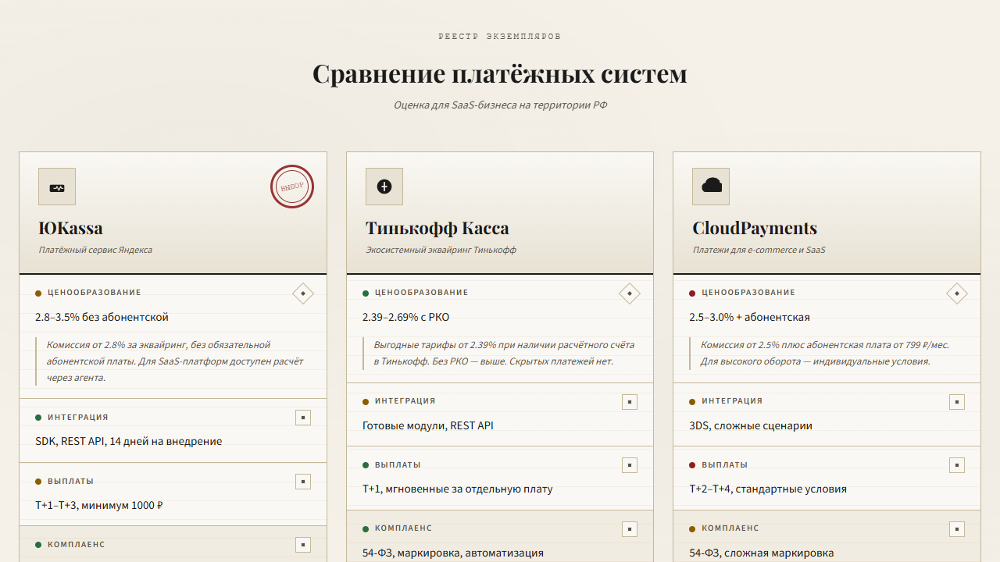
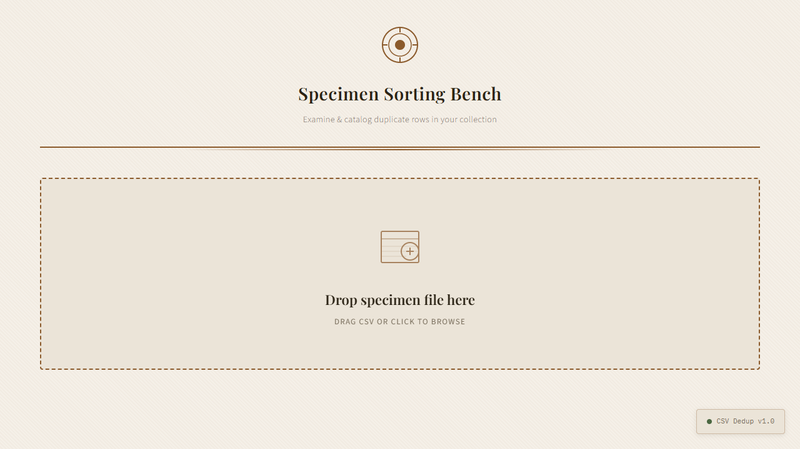
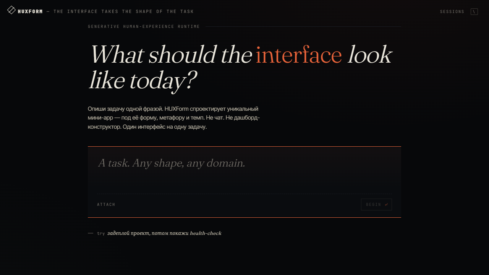

<div align="center">


<p>
  <a href="#quick-start"></a>
  
  
  
  
</p>

</div>

> **HUXForm** is a generative human-experience runtime for AI agents.
> You describe a task in plain language. HUXForm **directs** a one-off visual
> concept for it, generates a self-contained mini-app on the fly, and runs it
> inside a sandboxed stage that talks back through a safe bridge.

Not a chat. Not a dashboard kit. Not a component library. Every task gets its
own interface — designed for that task and forgotten when it's done.

```text
Intent → Plan + Visual Brief → Generated mini-app → Bridged tools
```

---

## Why "non-template"

A normal LLM-generated UI converges on the same generic look: three-column
dark cards, sidebar, hamburger, glassmorphism. Every task ends up feeling the
same. HUXForm fights this in two places:

1. **The Director** outputs a structured *visual brief* — a concrete metaphor
   (a duplicate-finder bench, a sonar sweep, a museum specimen card),
   palette, typography, motion, and an **explicit list of banned defaults**.
2. **The UI Generator** treats the brief as a constraint and refuses to fall
   back to the usual SaaS-app defaults.

The shell itself dissolves while you work: when a task is on stage, the
chrome fades, the palette of the generated app bleeds into the surrounding
frame, and the only thing on screen is the mini-app HUXForm built for *this*
moment.

<div align="center">
  <table>
    <tr>
      <td align="center" width="50%">
        
        <sub><b>explainer · technical specimen card</b><br/>"explain what MCP is" — cream parchment, serif display, taxonomy ledger</sub>
      </td>
      <td align="center" width="50%">
        
        <sub><b>decision_board · payment specimen cabinet</b><br/>"compare three payment processors" — side-by-side cards, real data</sub>
      </td>
    </tr>
    <tr>
      <td align="center" width="50%">
        
        <sub><b>generated_app · specimen sorting bench</b><br/>"check this CSV for duplicates" — working drop-zone bound to the tool broker</sub>
      </td>
      <td align="center" width="50%">
        
        <sub><b>landing · the moment of stillness</b><br/>one prompt, rotating hint, no chat history, no dashboard chrome</sub>
      </td>
    </tr>
  </table>
</div>

Same runtime, four completely different surfaces — picked and built per task.

---

## Quick start

Clone the repo and run one script. It checks your Python and Node versions,
creates a virtualenv, installs dependencies, prompts for your MiniMax key
(or any Anthropic-compatible / OpenAI-compatible key), starts both servers
and opens your browser.

**macOS / Linux / WSL**

```bash
git clone https://github.com/agiwhitelist/HUXForm.git
cd HUXForm
./bin/huxform
```

**Windows (PowerShell 7+)**

```powershell
git clone https://github.com/agiwhitelist/HUXForm.git
cd HUXForm
.\bin\huxform.ps1
```

That's it. The script does the rest:

```text
◇ HUXForm  — the interface takes the shape of the task
  ────────────────────────────────────────────────────

  setup
  ✓  python3 / node / npm preflight
  paste your MiniMax API key  ⟶  ······
  ✓  wrote .env
  api · creating Python venv
  api · installing dependencies
  web · installing dependencies
  ✓  setup complete.

  starting api on :8001 · web on :5173
  ✓  api ready (pid 12345)
  ✓  web ready (pid 67890)

  → http://localhost:5173
```

Next runs just need `./bin/huxform` (or `.\bin\huxform.ps1`) — setup is
skipped automatically.

### What you need before you start

|              | Version | Notes |
|--------------|---------|------|
| Python       | 3.11+   | `python3 --version` |
| Node.js      | 20+     | `node --version` |
| npm          | 10+     | bundled with Node |
| An LLM key   | —       | MiniMax M2 by default; or any Anthropic / OpenAI-compatible endpoint |

You can grab a free MiniMax key in five minutes at
[platform.minimax.io](https://platform.minimax.io/). To switch providers,
edit `.env` after first run (see [Provider configuration](#provider-configuration)).

### Other ways to run

```bash
make setup     # one-time install
make start     # equivalent to ./bin/huxform start
make doctor    # preflight check
make clean     # remove .venv / node_modules / data

docker compose up --build       # dev (web :5173, api :8001)
docker build --target production -t huxform .   # prod single image (nginx + uvicorn)
```

---

## Architecture

<div align="center">
  
</div>

| Module                              | Role                                                                                                   |
|-------------------------------------|--------------------------------------------------------------------------------------------------------|
| `apps/api/src/director.py`          | One LLM pass → presentation plan + visual brief (palette, typography, layout, motion, banned defaults) |
| `apps/api/src/codegen.py`           | UI Generator. Consumes the brief, emits one self-contained HTML document.                              |
| `apps/api/src/runtime_stub.py`      | `window.agui.*` shim injected into every generated document.                                           |
| `apps/api/src/executor.py`          | Tool Broker + Permission Layer + dry-run + approvals.                                                  |
| `apps/api/src/tools.py`             | Built-in capabilities (LLM, data.*, web.search, files.read, task.*, optional cli.*).                   |
| `apps/api/src/mcp_client.py`        | Stdio MCP-client manager. Auto-registers each MCP tool as `mcp.<alias>.<name>`.                        |
| `apps/api/src/openapi_adapter.py`   | Loads any OpenAPI 3.x spec, exposes every operation as `openapi.<alias>.<op>`.                         |
| `apps/api/src/narrator.py`          | Turns raw events into single-sentence human commentary.                                                |
| `apps/api/src/tasks.py`             | Domain model: Thread → Turn → events / state / files.                                                  |
| `apps/api/src/persistence.py`       | SQLite store with hydration on boot.                                                                   |
| `apps/api/src/audit.py`             | Append-only audit of tool calls and approvals.                                                         |
| `apps/web/src/App.tsx · Turn.tsx`   | Stage-first shell, palette sync, auto-fading chrome, history overlay.                                  |
| `apps/web/src/bridge.ts`            | Per-turn iframe ↔ backend bridge — proxy tool calls, upload files, stream events.                     |

---

## The interaction model

- **Stage first.** Each user prompt opens a *session*. The session is a
  full-bleed stage — no chat scrollback, no plan card in the way. The
  generated mini-app fills the screen; the shell fades away.
- **Plan steering.** Before codegen burns tokens you can ask the agent to
  confirm its approach (auto-proceed is on by default for safe tasks; it's
  off for destructive ones).
- **Refine + regenerate.** "Refine" the running interface with a sentence —
  "warmer palette, denser table, add an export button" — and HUXForm
  regenerates the document while keeping the metaphor.
- **File attachments.** Drop files into the generated UI (it has a real
  picker bound to the bridge), or attach them in the prompt before pressing
  enter. Available inside the iframe via `await agui.readFile(id)`.
- **Cancel anytime.** Hard cancel releases pending approvals, stops the
  pipeline and persists the cancelled state.
- **Inspector.** Per-turn raw event stream + token usage, hidden behind a
  side drawer (toggle with `⌘.`).
- **Sessions overlay.** Press `\` to open the gallery of past sessions —
  each card carries the palette swatches of its concept.

---

## Bridge API (inside the generated UI)

```js
agui.plan, agui.tools, agui.goal, agui.taskId, agui.files

await agui.callTool(name, params)          // run a registered tool
await agui.uploadFile(file)                // upload a File/Blob → auto-attached to the turn
await agui.readFile(file_id)               // read an attached file
await agui.askApproval(label, details)     // request a one-off human OK
agui.setState(patch)
agui.getState()
agui.finalResult(value)
agui.log(level, message)
agui.toast(message, kind)
agui.onEvent(handler)
```

The sandbox is `allow-scripts allow-forms` only — **no** `allow-same-origin`,
**no** unrestricted network, **no** parent DOM access. The bridge is the
only escape hatch. Direct `fetch('/api/...')` from generated code is
transparently rerouted through the bridge so legacy scaffolds still work.

---

## Provider configuration

HUXForm is provider-agnostic. Pick the protocol your provider speaks:

| Var                   | Default                              | Notes                                  |
|-----------------------|--------------------------------------|----------------------------------------|
| `AGUI_LLM_PROTOCOL`   | `anthropic`                          | `anthropic` (Messages) or `openai`     |
| `AGUI_LLM_BASE_URL`   | `https://api.minimax.io/anthropic`   | Provider base URL.                     |
| `AGUI_LLM_MODEL`      | `MiniMax-M2`                         | Model id.                              |
| `AGUI_LLM_API_KEY`    | —                                    | API key.                               |
| `AGUI_LLM_MAX_TOKENS` | `4096`                               |                                        |
| `AGUI_LLM_TEMPERATURE`| `0.6`                                |                                        |
| `TAVILY_API_KEY`      | —                                    | Real `web.search` if set.              |
| `AGUI_MCP_CONFIG`     | `.agui/mcp.json`                     | Optional MCP server config.            |
| `AGUI_DATA_DIR`       | `.huxform-data`                      | SQLite + uploads live here.            |
| `AGUI_ENABLE_CLI`     | unset                                | Enables `cli.*` host-CLI tools.        |
| `AGUI_CLI_ALLOWLIST`  | unset                                | Optional `:`-separated allowlist.      |

> Default is **MiniMax M2** via its Anthropic-compatible endpoint. Switch to
> Anthropic / OpenAI / Groq / OpenRouter / Together / Ollama by changing the
> four `AGUI_LLM_*` vars — no SDK changes required.

---

## Tool discovery

### MCP servers

Drop a `.agui/mcp.json` at repo root:

```json
{
  "servers": [
    { "alias": "fs",   "command": "npx", "args": ["-y", "@modelcontextprotocol/server-filesystem", "/tmp"] },
    { "alias": "git",  "command": "uvx", "args": ["mcp-server-git", "--repository", "."] }
  ]
}
```

On boot HUXForm spawns each server, calls `tools/list`, and registers every
tool as `mcp.<alias>.<name>` — immediately callable from any generated UI
via `agui.callTool(...)`.

### OpenAPI

```bash
curl -X POST http://localhost:8001/api/tools/openapi -H 'content-type: application/json' -d '{
  "alias": "petstore",
  "spec_url": "https://petstore3.swagger.io/api/v3/openapi.json",
  "base_url": "https://petstore3.swagger.io/api/v3",
  "auth_header_name": "Authorization",
  "auth_header_value": "Bearer ..."
}'
```

Every operation becomes a callable tool: `openapi.petstore.findPetsByStatus`,
etc.

### Host CLI tools

Set `AGUI_ENABLE_CLI=1` and optional `AGUI_CLI_ALLOWLIST=git:gh:jq`.
A curated set of common binaries (`git`, `gh`, `curl`, `jq`, `docker`,
`kubectl`, …) becomes available as `cli.<name>` tools, gated by approval.

---

## Endpoints

| Method | Path                                       | Purpose                                  |
|--------|--------------------------------------------|------------------------------------------|
| POST   | `/api/threads`                             | Create thread + first turn               |
| GET    | `/api/threads`                             | List threads                             |
| GET    | `/api/threads/{tid}`                       | Thread + ordered turns                   |
| POST   | `/api/threads/{tid}/turns`                 | Add a follow-up turn                     |
| GET    | `/api/turns/{tid}`                         | Snapshot                                 |
| GET    | `/api/turns/{tid}/ui`                      | Generated HTML (with runtime injected)   |
| GET    | `/api/turns/{tid}/events`                  | SSE event stream (replayable)            |
| POST   | `/api/turns/{tid}/tools/{name}`            | Run a tool (bridge target)               |
| POST   | `/api/turns/{tid}/approve`                 | Resolve a pending approval               |
| POST   | `/api/turns/{tid}/proceed`                 | Proceed past plan steering               |
| POST   | `/api/turns/{tid}/cancel`                  | Cancel a turn                            |
| POST   | `/api/turns/{tid}/regenerate`              | Re-run codegen, optional `refine_note`   |
| POST   | `/api/turns/{tid}/files`                   | Attach an already-uploaded file to a turn|
| POST   | `/api/files`                               | Upload a file                            |
| GET    | `/api/files/{fid}`                         | Download                                 |
| GET    | `/api/tools`                               | Registered tools                         |
| POST   | `/api/tools/openapi`                       | Register an OpenAPI spec                 |
| GET    | `/api/audit?turn_id=&limit=`               | Audit tail                               |

---

## Project layout

```text
HUXForm/
├── apps/
│   ├── api/                # FastAPI backend
│   │   ├── pyproject.toml
│   │   └── src/
│   └── web/                # Vite + React shell
│       ├── package.json
│       └── src/
├── assets/                 # banner, sigil, architecture, sample screenshots
├── bin/
│   ├── huxform             # macOS/Linux/WSL bootstrap
│   └── huxform.ps1         # Windows PowerShell bootstrap
├── Dockerfile
├── docker-compose.yml
├── Makefile
├── README.md
└── LICENSE
```

---

## Troubleshooting

| Symptom | Likely cause | Fix |
|---|---|---|
| `./bin/huxform` says `python3` missing | not installed or not on PATH | install [Python 3.11+](https://www.python.org/downloads/), reopen shell |
| `./bin/huxform` says `node` missing | not installed or not on PATH | install [Node 20+](https://nodejs.org/), reopen shell |
| `getaddrinfo failed` in api log | local DNS unable to resolve provider | switch DNS to `1.1.1.1` / `8.8.8.8`, or use a different provider in `.env` |
| `AGUI_LLM_API_KEY not configured` | `.env` missing or default value | re-run `./bin/huxform setup` |
| port 8001 / 5173 already in use | another process bound it | stop the other process, or set `--port` on the script |
| sandbox iframe shows blank in Firefox | older Firefox didn't allow `allow-forms` in sandboxed iframes for inputs | use Chrome / Edge, or upgrade Firefox |

You can always check state with `./bin/huxform doctor`.

---

## Roadmap

- [ ] Streaming partial codegen (watch the document being drawn line by line)
- [ ] LLM router for "refine current turn vs. open a new turn"
- [ ] HTTP/SSE transport for MCP (right now: stdio only)
- [ ] Cost dashboard + per-tool latency
- [ ] Saved presets per organization (palette / typography defaults)
- [ ] Multi-user mode with per-session isolation

---

## Contributing

Issues and pull requests welcome. If you're proposing a new presentation
mode or visual concept, open a discussion first — the contract between the
Director and the UI Generator is intentionally narrow and we'd like to keep
it that way.

---

<div align="center">
  <sub>
    HUXForm · MIT · the interface takes the shape of the task
  </sub>
</div>
