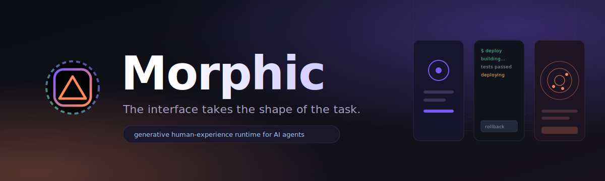
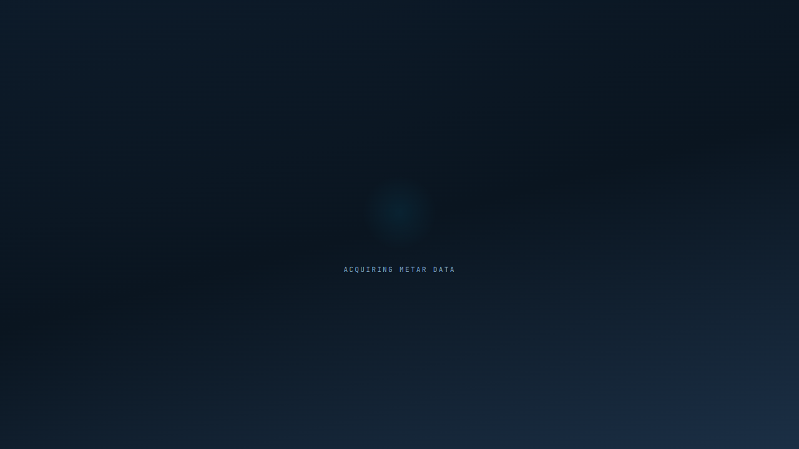
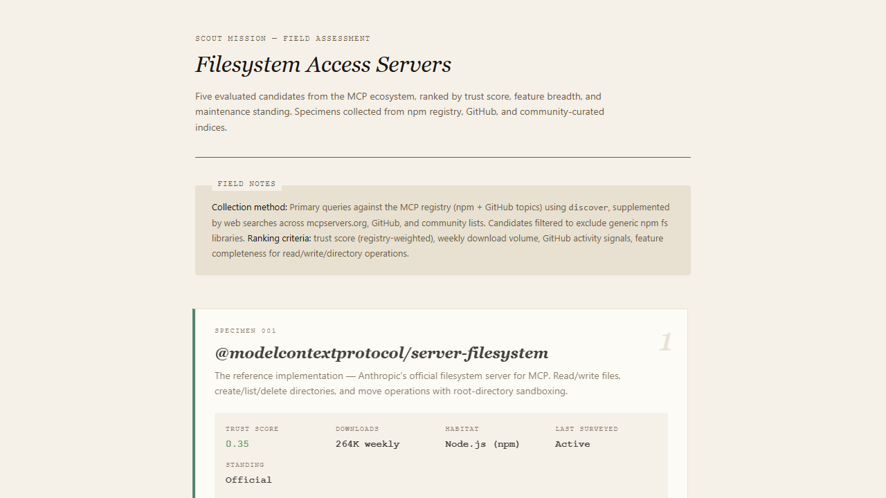
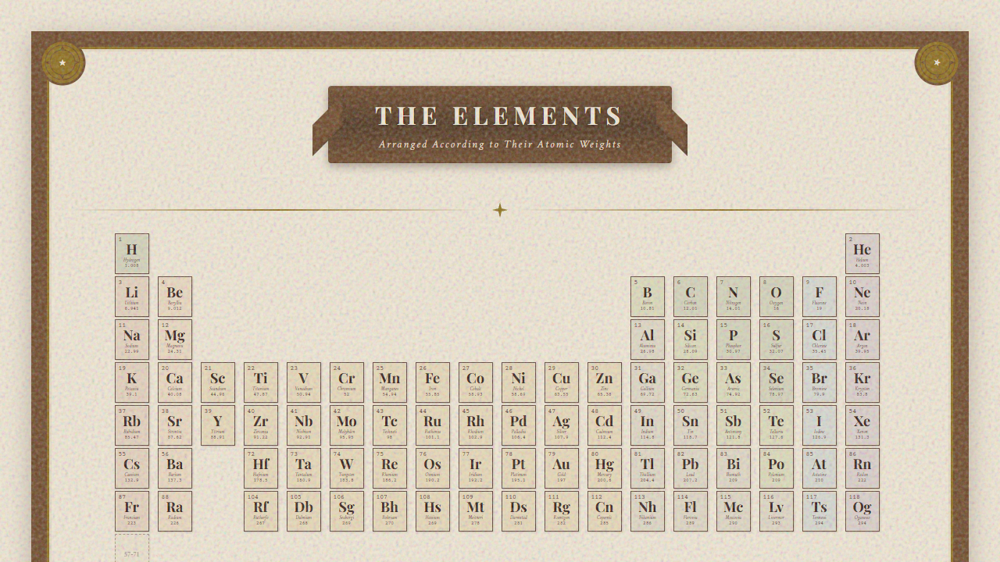
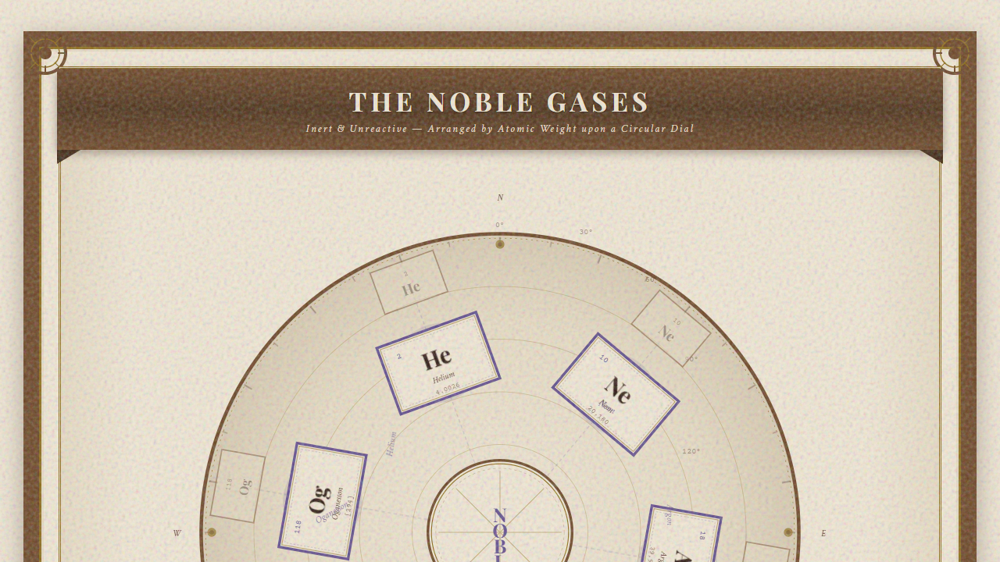
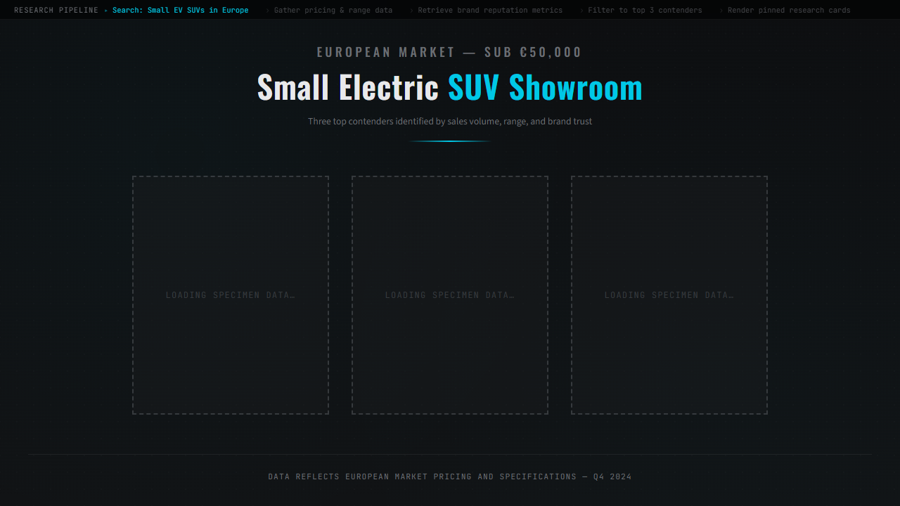
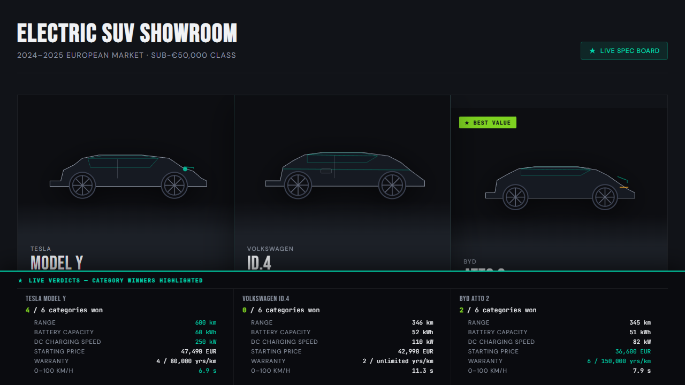
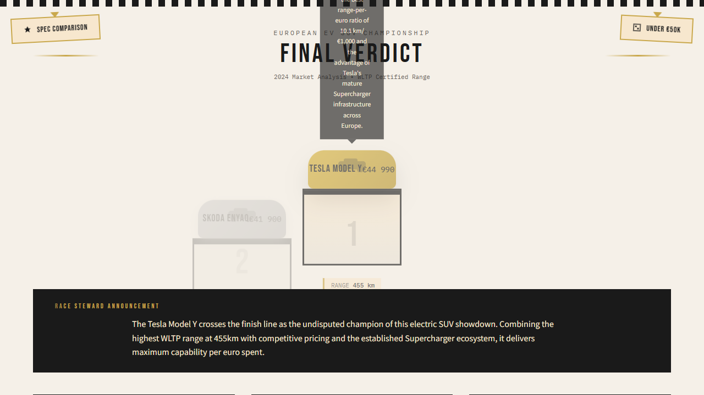
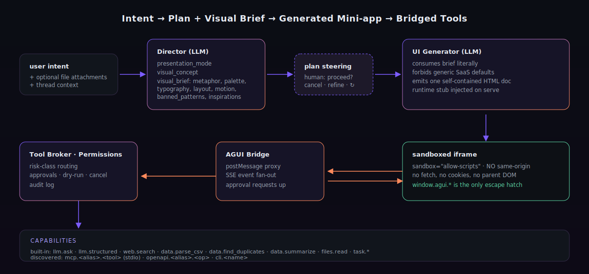

<div align="center">



<p>
  <a href="#quick-start"></a>
  
  
  
  
</p>

</div>

<div align="center">

### See it run


**[▶ Full-resolution video](./demo/huxform-demo.mp4)** · [12 hero stills](./demo)

</div>

> **About the demo.** The 80-second clip above is a deterministic HTML/CSS
> render of one audit run, kept reproducible for the README. A live HUXForm
> run varies in its visual metaphor — the Director may draw the same security
> audit as a ledger, an inspection station, or a console, and that variety is
> the point. The tool calls, the OSV/GHSA vulnerability data, and the MCP
> discovery flow shown are all real.

> **HUXForm is a runtime for generative software.**
> You describe a task in one sentence. HUXForm **directs** a one-off visual
> concept for it, **researches** the task with real tools (web search, fetch,
> MCP servers, CLI, OpenAPI), **generates** a self-contained mini-app on the
> fly, **streams** it onto the stage as the model draws it, and gives it a
> safe bridge to call tools back — including the ability to **redesign
> itself** mid-conversation.

Not a chat. Not a dashboard kit. Not a component library. Not a wrapper
around someone else's UI. **Every task gets a custom piece of software,
with real data, and that software is allowed to rewrite itself.**

```text
Intent
  → Director (plan + visual brief)
  → Researcher (real tool calls: web.search, web.fetch, mcp.*, files.read…)
  → UI Generator (streaming HTML/CSS/JS, watch it being drawn)
  → Sandboxed stage + bridge (the app calls tools; can also self-redesign)
  → Mission loop (optional: chain N turns toward one bigger goal)
```

### Five things almost no other AI tool ships

| # | Capability | Why it matters |
|---|-----------|----------------|
| 1 | **Generative UI, not a template** | The Director commits to a metaphor (a meteo station, a field notebook, a podium ceremony, a sonar sweep) **before any code is written**, with banned defaults. The UI Generator treats the brief as a constraint. Outputs converge to a one-off mini-app, never to "another dashboard". |
| 2 | **Real data, not hallucination** | A server-side **Researcher** ReAct loop calls live tools (DuckDuckGo, optional Tavily/Brave/Serper, MCP servers, attached files) until it has facts. The codegen prompt forbids inventing numbers; the iframe receives `agui.research` as ground truth. |
| 3 | **Streaming codegen** | The LLM streams HTML tokens. HUXForm injects the partial document into the iframe via `srcDoc` every ~120 ms — **you watch the app being designed live**: palette appears first, then the title, then sections fill in, then SVG details. On `ui_ready` the live, bridge-wired version swaps in. |
| 4 | **Self-evolving UI** | From inside the iframe, a generated app can call `await agui.evolve("show me the same data as a sparkline grid")`. HUXForm regenerates the document around the existing task state and the iframe swaps to the new shape. The interface stays alive instead of accumulating dead toggles. |
| 5 | **Live tool discovery + audited install** | `tools.discover` ranks candidates from npm `@modelcontextprotocol/*` + GitHub `topic:mcp-server`. `audit_top=N` reads each top candidate's README and asks an LLM to classify permissions, surface red flags ("ZIP extraction → path traversal") and compute a trust score. `tools.install` is approval-gated **every time** and spawns the chosen MCP server through either stdio or the streamable-HTTP transport. `tools.uninstall` undoes it. |

### Plus one new layer above turns: Missions

A user prompt is a single Turn. A **Mission** is multiple Turns chained
toward one bigger goal. `POST /api/threads/{tid}/missions` with a goal,
HUXForm breaks it into 3-7 concrete steps, spawns one Turn per step, and
auto-advances when the prior step's UI reaches the stage. Each step
renders its **own** mini-app with its own metaphor.

```text
Mission: "compare three small electric SUVs under €50k"

  step 1  ▶  Research SUVs in Europe        → "Small Electric SUV Showroom"  research-pipeline ribbon, dark museum case
  step 2  ▶  Build comparison board         → "ELECTRIC SUV SHOWROOM"       glossy auto-dealer with line-art silhouettes
  step 3  ▶  Deliver final verdict          → "FINAL VERDICT"                F1-style podium with Tesla Model Y at #1
```

Same mission. Three completely different interfaces, picked for what each step actually needs.

---

## Why "non-template"

A normal LLM-generated UI converges on the same generic look: three-column
dark cards, sidebar, hamburger, glassmorphism. Every task ends up feeling the
same. HUXForm fights this in two places:

1. **The Director** outputs a structured *visual brief* — a concrete metaphor
   (a duplicate-finder bench, a sonar sweep, a museum specimen card),
   palette, typography, motion, and an **explicit list of banned defaults**.
2. **The UI Generator** treats the brief as a constraint and refuses to fall
   back to the usual SaaS-app defaults.

The shell itself dissolves while you work: when a task is on stage, the
chrome fades, the palette of the generated app bleeds into the surrounding
frame, and the only thing on screen is the mini-app HUXForm built for *this*
moment.

<div align="center">
  <table>
    <tr>
      <td align="center" width="50%">
        
        <sub><b>explainer · meteo station card</b><br/>"what is the current weather in New York City?" — Researcher called <code>web.search</code>, parsed real conditions from AccuWeather + Weather Underground; inline-SVG sun/cloud, real 56°F / 63% humidity baked in</sub>
      </td>
      <td align="center" width="50%">
        
        <sub><b>report · field assessment</b><br/>"find me the 5 best MCP servers for filesystem access" — Researcher called <code>tools.discover</code> + <code>web.search</code>; rendered as a botanist's field notebook with real trust scores and download counts</sub>
      </td>
    </tr>
    <tr>
      <td align="center" width="50%">
        
        <sub><b>generated_app · vintage scientific chart</b><br/>"draw me a periodic table styled as a vintage poster" — streamed live: parchment appears first, then ornate Victorian header, then the grid fills row-by-row. <a href="#streaming-codegen-watch-the-app-being-drawn">how streaming works ↓</a></sub>
      </td>
      <td align="center" width="50%">
        
        <sub><b>evolved · noble-gas dial</b><br/>From the periodic-table iframe, <code>agui.evolve("circular dial, only noble gases, keep parchment palette")</code>. Same turn, same state — new shape, same identity. <a href="#self-evolving-ui-agui-evolve">how evolve works ↓</a></sub>
      </td>
    </tr>
    <tr>
      <td colspan="2" align="center">
        <table>
          <tr>
            <td align="center" width="33%">
              
              <sub><b>mission · step 1/3</b><br/>"Research available small electric SUVs under €50k" — research-pipeline ribbon, dark museum case</sub>
            </td>
            <td align="center" width="33%">
              
              <sub><b>mission · step 2/3</b><br/>"Build comparison board" — glossy auto-dealer with line-art silhouettes, real spec rows, "BEST VALUE" badge</sub>
            </td>
            <td align="center" width="33%">
              
              <sub><b>mission · step 3/3</b><br/>"Deliver final verdict" — F1-style podium ceremony, Tesla Model Y at #1, "RACE STEWARD ANNOUNCEMENT"</sub>
            </td>
          </tr>
        </table>
        <sub>One mission. Three completely different metaphors. The Mission loop chose them, the Director designed them, the Researcher fed them real data, the Generator drew them live.</sub>
      </td>
    </tr>
  </table>
</div>

---

## Quick start

Clone the repo and run one script. It checks your Python and Node versions,
creates a virtualenv, installs dependencies, prompts for an LLM API key
(any Anthropic-compatible or OpenAI-compatible provider), starts both
servers and opens your browser.

**macOS / Linux / WSL**

```bash
git clone https://github.com/agiwhitelist/HUXForm.git
cd HUXForm
./bin/huxform
```

**Windows (PowerShell 7+)**

```powershell
git clone https://github.com/agiwhitelist/HUXForm.git
cd HUXForm
.\bin\huxform.ps1
```

That's it. The script does the rest:

```text
◇ HUXForm  — the interface takes the shape of the task
  ────────────────────────────────────────────────────

  setup
  ✓  python3 / node / npm preflight
  paste your LLM API key  ⟶  ······
  ✓  wrote .env
  api · creating Python venv
  api · installing dependencies
  web · installing dependencies
  ✓  setup complete.

  starting api on :8001 · web on :5173
  ✓  api ready (pid 12345)
  ✓  web ready (pid 67890)

  → http://localhost:5173
```

Next runs just need `./bin/huxform` (or `.\bin\huxform.ps1`) — setup is
skipped automatically.

### What you need before you start

|              | Version | Notes |
|--------------|---------|------|
| Python       | 3.11+   | `python3 --version` |
| Node.js      | 20+     | `node --version` |
| npm          | 10+     | bundled with Node |
| An LLM key   | —       | Any Anthropic-compatible or OpenAI-compatible provider. Bring your own model. |

Anthropic, OpenAI, MiniMax, OpenRouter, Groq, Together, AWS Bedrock,
Ollama — anything that speaks one of the two protocols works. Edit `.env`
after the first run to switch (see [Provider configuration](#provider-configuration)).

### Other ways to run

```bash
make setup     # one-time install
make start     # equivalent to ./bin/huxform start
make doctor    # preflight check
make clean     # remove .venv / node_modules / data

docker compose up --build       # dev (web :5173, api :8001)
docker build --target production -t huxform .   # prod single image (nginx + uvicorn)
```

---

## Architecture

<div align="center">
  
</div>

| Module                              | Role                                                                                                   |
|-------------------------------------|--------------------------------------------------------------------------------------------------------|
| `apps/api/src/director.py`          | One LLM pass → presentation plan + visual brief (palette, typography, layout, motion, banned defaults) |
| `apps/api/src/researcher.py`        | Server-side ReAct loop. Calls read/network tools before codegen; results land in `turn.state.research`.|
| `apps/api/src/codegen.py`           | UI Generator. Streams HTML token-by-token; consumes the brief + research; supports `agui.evolve()` regeneration.|
| `apps/api/src/mission.py`           | Mission planner + driver. Breaks a goal into 3-7 steps, spawns one Turn per step, auto-advances.       |
| `apps/api/src/runtime_stub.py`      | `window.agui.*` shim injected into every generated document (`agui.research`, `agui.evolve`, …).        |
| `apps/api/src/executor.py`          | Tool Broker + Permission Layer + dry-run + approvals.                                                  |
| `apps/api/src/tools.py`             | Built-in capabilities (LLM, data.\*, web.\*, files.read, task.\*, tools.discover/install/uninstall, optional cli.\*). |
| `apps/api/src/web_search.py`        | Multi-provider web search: Tavily → Brave → Serper → DuckDuckGo (default, no key) → SearXNG.           |
| `apps/api/src/discovery.py`         | Tool Discovery + Capability Registry. `discover_tools()` ranks MCP candidates and audits READMEs.      |
| `apps/api/src/mcp_client.py`        | MCP client. **stdio** subprocesses and **streamable-HTTP** remotes — both registered as `mcp.<alias>.<name>`.|
| `apps/api/src/openapi_adapter.py`   | Loads any OpenAPI 3.x spec, exposes every operation as `openapi.<alias>.<op>`.                         |
| `apps/api/src/llm.py`               | Provider-agnostic LLM client. Anthropic Messages + OpenAI Chat Completions, blocking + streaming.      |
| `apps/api/src/narrator.py`          | Turns raw events into single-sentence human commentary.                                                |
| `apps/api/src/tasks.py`             | Domain model: Thread → Turn → events / state / files; Mission → Steps.                                 |
| `apps/api/src/persistence.py`       | SQLite store with hydration on boot.                                                                   |
| `apps/api/src/audit.py`             | Append-only audit of tool calls and approvals.                                                         |
| `apps/web/src/App.tsx · Turn.tsx`   | Stage-first shell, palette sync, auto-fading chrome, history overlay, streaming-iframe srcDoc preview, high-risk approval modal.|
| `apps/web/src/bridge.ts`            | Per-turn iframe ↔ backend bridge. Tool calls, file upload, SSE events, `agui.evolve` proxy.            |

---

## The interaction model

- **Stage first.** Each user prompt opens a *session*. The session is a
  full-bleed stage — no chat scrollback, no plan card in the way. The
  generated mini-app fills the screen; the shell fades away.
- **Plan steering.** Before codegen burns tokens you can ask the agent to
  confirm its approach (auto-proceed is on by default for safe tasks; it's
  off for destructive ones).
- **Refine + regenerate.** "Refine" the running interface with a sentence —
  "warmer palette, denser table, add an export button" — and HUXForm
  regenerates the document while keeping the metaphor.
- **File attachments.** Drop files into the generated UI (it has a real
  picker bound to the bridge), or attach them in the prompt before pressing
  enter. Available inside the iframe via `await agui.readFile(id)`.
- **Cancel anytime.** Hard cancel releases pending approvals, stops the
  pipeline and persists the cancelled state.
- **Inspector.** Per-turn raw event stream + token usage, hidden behind a
  side drawer (toggle with `⌘.`).
- **Sessions overlay.** Press `\` to open the gallery of past sessions —
  each card carries the palette swatches of its concept.

---

## Streaming codegen — watch the app being drawn

The Codegen pass uses `LLMClient.complete_stream()` (Anthropic SSE or OpenAI
SSE — both supported) and pushes the accumulated buffer through an
`on_chunk` callback every ~120 ms / ~400 chars. The driver emits each
buffer as `codegen_chunk` on the turn's SSE stream. The host shell pipes
those into `iframe.srcDoc` after a small sanitisation pass (strips inline
`<script>` blocks, trailing partial tags, and any leading markdown fence
the model might wrap the document in).

What the user sees:

```text
[t = 0.0 s]  curtain · "phase 02 · drawing"
[t = 1.2 s]  parchment background appears in the iframe
[t = 1.8 s]  ornate Victorian title materializes
[t = 3.0 s]  table grid starts filling, row by row
[t = 7.0 s]  inline SVG elements (sun, cloud, sigils) draw in
[t = 9.0 s]  ui_ready → iframe swaps to live bridge-wired URL
```

On `ui_ready` the iframe `srcDoc` is cleared and `src` is set to
`/api/turns/{id}/ui` — the live URL serves the same HTML with the runtime
stub injected, so the bridge wakes up and the generated JS starts running.

This works even when the LLM hits 6-7 seconds of latency: the user is
*reading* a real interface forming on the page, not staring at a spinner.

---

## Self-evolving UI (`agui.evolve`)

From inside a generated mini-app the JavaScript can ask HUXForm to
**redraw the whole document around the same task state**:

```js
// inside the generated UI, on a button click
document.getElementById('compare').addEventListener('click', async () => {
  await agui.evolve('switch to a side-by-side table comparing both options, keep palette');
});
```

Under the hood the bridge posts to `POST /api/turns/{turn_id}/regenerate`
with the refine note, the codegen runs again (also streamed), and the
iframe swaps to the new HTML on `ui_ready`. The turn ID, thread, state,
files, and research results are all preserved — only the document changes.

The codegen prompt forbids the generated UI from using `display:none`
toggles to hide alternate views: when the user wants a different shape,
call `agui.evolve()`. The interface stays alive instead of accumulating
dead UI surface.

Real example: starting from a full periodic-table mini-app, calling
`agui.evolve('circular dial, only noble gases, keep parchment palette')`
produces a new document where the layout is a circular dial with He / Ne /
Ar / Kr cards arranged around it, palette preserved, title rewritten —
**same turn**.

---

## Mission loop — multi-turn agentic execution

A Turn is one user prompt → one mini-app. A Mission is one **goal** → 3-7
auto-spawned Turns, each producing its own mini-app, advancing the goal
step by step.

```bash
curl -X POST http://localhost:8001/api/threads/{thread_id}/missions \
  -H 'content-type: application/json' \
  -d '{"goal": "compare three small electric SUVs under 50k EUR"}'
# → { "mission_id": "...", "thread_id": "..." }
```

What happens:

1. `apps/api/src/mission.py` calls the Mission Planner LLM, which breaks
   the goal into 3-7 concrete steps with titles + detail sentences.
2. For each step, HUXForm creates a child Turn in the same thread
   (`auto_proceed=True`), kicks off the full Director → Researcher →
   Codegen pipeline, and waits for the iframe to reach the stage (status
   `running`) before advancing.
3. Each step's Turn carries `state.mission = { id, step, of, title }` so
   the frontend can show a "step 2/3 · build comparison board" badge.
4. The mission emits `mission_planning`, `mission_plan_ready`,
   `mission_step_started`, `mission_step_done`, `mission_done` events on
   its own SSE stream at `/api/missions/{mid}/events`.

Endpoints:

| Method | Path                                       | Purpose                            |
|--------|--------------------------------------------|------------------------------------|
| POST   | `/api/threads/{tid}/missions`              | Create + start a mission           |
| GET    | `/api/missions/{mid}`                      | Mission snapshot (steps + status)  |
| GET    | `/api/missions/{mid}/events`               | SSE event stream                   |
| GET    | `/api/threads/{tid}/missions`              | List a thread's missions           |
| POST   | `/api/missions/{mid}/cancel`               | Cancel; halts after the current step finishes |

---

## Bridge API (inside the generated UI)

```js
agui.plan, agui.tools, agui.goal, agui.taskId, agui.files
agui.research                              // { summary, steps: [{tool, params, result, ok, ...}], stopped }

await agui.callTool(name, params)          // run a registered tool
await agui.uploadFile(file)                // upload a File/Blob → auto-attached to the turn
await agui.readFile(file_id)               // read an attached file
await agui.askApproval(label, details)     // request a one-off human OK
agui.setState(patch)
agui.getState()
agui.finalResult(value)
agui.log(level, message)
agui.toast(message, kind)
agui.onEvent(handler)
```

`agui.research` is pre-filled by the server-side Researcher loop, so the
mini-app can render facts directly without an extra round-trip:

```js
const r = agui.research?.steps?.[0]?.result;
if (r?.results?.length) renderList(r.results);
```

The sandbox is `allow-scripts allow-forms` only — **no** `allow-same-origin`,
**no** unrestricted network, **no** parent DOM access. The bridge is the
only escape hatch. Direct `fetch('/api/...')` from generated code is
transparently rerouted through the bridge so legacy scaffolds still work.

---

## Provider configuration

HUXForm is provider-agnostic. Pick the protocol your provider speaks:

| Var                   | Default                              | Notes                                                            |
|-----------------------|--------------------------------------|------------------------------------------------------------------|
| `AGUI_LLM_PROTOCOL`   | `anthropic`                          | `anthropic` (Messages) or `openai`                               |
| `AGUI_LLM_BASE_URL`   | `https://api.anthropic.com`          | Provider base URL — point anywhere.                              |
| `AGUI_LLM_MODEL`      | (provider model id)                  | Any model your provider exposes.                                 |
| `AGUI_LLM_API_KEY`    | —                                    | API key.                                                         |
| `AGUI_LLM_MAX_TOKENS` | `4096`                               |                                                                  |
| `AGUI_LLM_TEMPERATURE`| `0.6`                                |                                                                  |
| `TAVILY_API_KEY`      | —                                    | Optional. `web.search` already works without a key (DuckDuckGo). |
| `BRAVE_API_KEY`       | —                                    | Optional. Brave Search API — 2k req/mo free.                     |
| `SERPER_API_KEY`      | —                                    | Optional. Google results via serper.dev free tier.               |
| `GITHUB_TOKEN`        | —                                    | Optional. Authenticates `web.fetch` against `api.github.com` and raises the limit used by `tools.discover` (60 → 5000 req/h). |
| `AGUI_WEB_PROXY`      | —                                    | Optional. Routes web search / fetch through an HTTP proxy (the LLM client stays direct). |
| `AGUI_MCP_CONFIG`     | `.agui/mcp.json`                     | MCP server config (seeded from `.agui/mcp.json.example`).        |
| `AGUI_DATA_DIR`       | `.huxform-data`                      | SQLite + uploads + capability registry live here.                |
| `AGUI_ENABLE_CLI`     | `1` (set by bootstrap)               | Registers `cli.*` host-CLI tools. Every call needs approval.     |
| `AGUI_CLI_ALLOWLIST`  | unset                                | Optional `:`-separated allowlist.                                |

> HUXForm doesn't care which model you bring. Anthropic, OpenAI, MiniMax,
> Groq, OpenRouter, Together, AWS Bedrock proxy, Ollama — anything that
> speaks the Anthropic Messages API or the OpenAI Chat Completions API
> works. Change the four `AGUI_LLM_*` vars — no SDK changes required.

---

## Tools

### Built-in catalog

`/api/tools` returns the live registry. Out of the box:

| Tool                | Risk         | What it does                                                                    |
|---------------------|--------------|---------------------------------------------------------------------------------|
| `llm.ask`           | read         | Send a free-form prompt to HUXForm's LLM. Short reasoning / copywriting.        |
| `llm.structured`    | read         | Ask the LLM for a JSON value matching a schema hint.                            |
| `web.search`        | network      | Real web search. DuckDuckGo by default; Tavily/Brave/Serper if their key is set.|
| `web.fetch`         | network      | GET a URL and return readable text + title + meta description (JSON auto-parsed). Authenticates `api.github.com` when `GITHUB_TOKEN` is set. |
| `osv.scan`          | network      | Scan a dependency list against the OSV.dev database (GHSA / CVE / PyPA). Returns confirmed vulnerabilities with severity and fixed versions. |
| `data.parse_csv`    | read         | Parse CSV text into typed columns + rows (auto-sniffs delimiter).               |
| `data.find_duplicates` | read      | Group rows by chosen keys, return duplicate groups.                             |
| `data.summarize`    | read         | Per-column stats: non-empty, distinct, top values, min/max/mean.                |
| `files.read`        | read         | Read a file the user attached to this turn.                                     |
| `tools.discover`    | network      | Search MCP ecosystem (GitHub topic:mcp-server + npm). Returns trust-ranked candidates. |
| `tools.install`     | destructive  | Approval-gated. Spawn an MCP server, register every tool it advertises.         |
| `task.set_state`    | write        | Merge a JSON patch into the persistent task state.                              |
| `task.final_result` | write        | Mark the turn done with a result.                                               |
| `task.log`          | write        | Emit a log event into the task stream.                                          |
| `cli.<bin>`         | filesystem / destructive | Wrappers for host binaries (`git`, `gh`, `curl`, `jq`, …) — every call needs approval. |

### MCP servers (stdio + HTTP)

The bootstrap seeds `.agui/mcp.json` from `.agui/mcp.json.example`. Both
transports work in the same file:

```json
{
  "servers": [
    { "alias": "fs",    "command": "npx", "args": ["-y", "@modelcontextprotocol/server-filesystem", "./workspace"] },
    { "alias": "fetch", "command": "uvx", "args": ["mcp-server-fetch"] },
    { "alias": "git",   "command": "uvx", "args": ["mcp-server-git", "--repository", "."] },

    { "alias": "notion",
      "url": "https://api.notion.com/mcp",
      "headers": { "Authorization": "Bearer secret_xxx", "Notion-Version": "2022-06-28" } }
  ]
}
```

- An entry with `command` uses the **stdio** transport (child process).
- An entry with `url` uses the **streamable-HTTP** transport
  (https://spec.modelcontextprotocol.io/...). Auth lives in `headers`.

`./workspace` is a sandboxed directory committed with a `.keep` marker —
the filesystem MCP server is rooted there, so generated UIs that write
files can't escape it.

On boot HUXForm starts each server, calls `tools/list`, and registers
every tool as `mcp.<alias>.<name>` — immediately callable from any
generated UI via `agui.callTool(...)`.

### Live tool discovery + install (the idea.md flow)

The agent can find new tools at runtime:

```js
// inside a generated UI — or just call from /api directly
const r = await agui.callTool('tools.discover', { query: 'slack' });
//  → { candidates: [{ source, id, install_suggestion: { command, args, alias },
//                     trust_score, description, ... }, ...] }

// install the top candidate (this fires an approval_required event
// the user must accept in the host shell):
await agui.callTool('tools.install', r.candidates[0].install_suggestion);
// → spawns the MCP server, registers tools as mcp.<alias>.<tool>
//   and persists the install to .huxform-data/capability_registry.json
```

The `CapabilityRegistry` survives restarts — installed servers are
re-spawned on the next boot, so the agent's tool catalog grows over time.

### OpenAPI

```bash
curl -X POST http://localhost:8001/api/tools/openapi -H 'content-type: application/json' -d '{
  "alias": "petstore",
  "spec_url": "https://petstore3.swagger.io/api/v3/openapi.json",
  "base_url": "https://petstore3.swagger.io/api/v3",
  "auth_header_name": "Authorization",
  "auth_header_value": "Bearer ..."
}'
```

Every operation becomes a callable tool: `openapi.petstore.findPetsByStatus`,
etc.

---

## Endpoints

| Method | Path                                       | Purpose                                  |
|--------|--------------------------------------------|------------------------------------------|
| POST   | `/api/threads`                             | Create thread + first turn               |
| GET    | `/api/threads`                             | List threads                             |
| GET    | `/api/threads/{tid}`                       | Thread + ordered turns                   |
| POST   | `/api/threads/{tid}/turns`                 | Add a follow-up turn                     |
| GET    | `/api/turns/{tid}`                         | Snapshot                                 |
| GET    | `/api/turns/{tid}/ui`                      | Generated HTML (with runtime injected)   |
| GET    | `/api/turns/{tid}/events`                  | SSE event stream (replayable)            |
| POST   | `/api/turns/{tid}/tools/{name}`            | Run a tool (bridge target)               |
| POST   | `/api/turns/{tid}/approve`                 | Resolve a pending approval               |
| POST   | `/api/turns/{tid}/proceed`                 | Proceed past plan steering               |
| POST   | `/api/turns/{tid}/cancel`                  | Cancel a turn                            |
| POST   | `/api/turns/{tid}/regenerate`              | Re-run codegen, optional `refine_note`   |
| POST   | `/api/turns/{tid}/files`                   | Attach an already-uploaded file to a turn|
| POST   | `/api/files`                               | Upload a file                            |
| GET    | `/api/files/{fid}`                         | Download                                 |
| GET    | `/api/tools`                               | Registered tools                         |
| POST   | `/api/tools/openapi`                       | Register an OpenAPI spec                 |
| POST   | `/api/threads/{tid}/missions`              | Create + start a mission                 |
| GET    | `/api/missions/{mid}`                      | Mission snapshot                         |
| GET    | `/api/missions/{mid}/events`               | Mission SSE event stream                 |
| GET    | `/api/threads/{tid}/missions`              | List a thread's missions                 |
| POST   | `/api/missions/{mid}/cancel`               | Cancel a mission                         |
| GET    | `/api/audit?turn_id=&limit=`               | Audit tail                               |

---

## Project layout

```text
HUXForm/
├── apps/
│   ├── api/                # FastAPI backend
│   │   ├── pyproject.toml
│   │   └── src/
│   └── web/                # Vite + React shell
│       ├── package.json
│       └── src/
├── assets/                 # banner, sigil, architecture, sample screenshots
├── bin/
│   ├── huxform             # macOS/Linux/WSL bootstrap
│   └── huxform.ps1         # Windows PowerShell bootstrap
├── Dockerfile
├── docker-compose.yml
├── Makefile
├── README.md
└── LICENSE
```

---

## Troubleshooting

| Symptom | Likely cause | Fix |
|---|---|---|
| `./bin/huxform` says `python3` missing | not installed or not on PATH | install [Python 3.11+](https://www.python.org/downloads/), reopen shell |
| `./bin/huxform` says `node` missing | not installed or not on PATH | install [Node 20+](https://nodejs.org/), reopen shell |
| `getaddrinfo failed` in api log | local DNS unable to resolve provider | switch DNS to `1.1.1.1` / `8.8.8.8`, or use a different provider in `.env` |
| `AGUI_LLM_API_KEY not configured` | `.env` missing or default value | re-run `./bin/huxform setup` |
| port 8001 / 5173 already in use | another process bound it | stop the other process, or set `--port` on the script |
| sandbox iframe shows blank in Firefox | older Firefox didn't allow `allow-forms` in sandboxed iframes for inputs | use Chrome / Edge, or upgrade Firefox |

You can always check state with `./bin/huxform doctor`.

---

## Roadmap

Done:

- [x] Server-side Researcher loop — call real tools before codegen
- [x] Real web search by default (no API key required)
- [x] `tools.discover` + `tools.install` for live MCP discovery
- [x] LLM-graded trust scoring (read candidate README, classify permissions)
- [x] `tools.uninstall` + capability registry persistence
- [x] Streaming partial codegen (watch the document being drawn live)
- [x] Self-evolving UI (`agui.evolve` from inside the iframe)
- [x] Multi-turn Mission loop (one goal → N auto-spawned turns)
- [x] Streamable-HTTP transport for MCP (remote / hosted servers)

Next:

- [ ] Voice in / voice out — Whisper transcript + TTS narration synced with codegen
- [ ] Camera / image input — drop a photo, get a task-shaped mini-app
- [ ] One-click share — public read-only URL with frozen state
- [ ] Mission progress ribbon in the host shell (`step 2 / 5` badge)
- [ ] Settings panel for capability registry (uninstall / inspect / re-audit)
- [ ] LLM router for "refine current turn vs. open a new turn"
- [ ] Cost dashboard + per-tool latency
- [ ] Saved presets per organization (palette / typography defaults)
- [ ] Multi-user mode with per-session isolation

---

## Contributing

Issues and pull requests welcome. If you're proposing a new presentation
mode or visual concept, open a discussion first — the contract between the
Director and the UI Generator is intentionally narrow and we'd like to keep
it that way.

---

<div align="center">
  <sub>
    HUXForm · MIT · the interface takes the shape of the task
  </sub>
</div>
